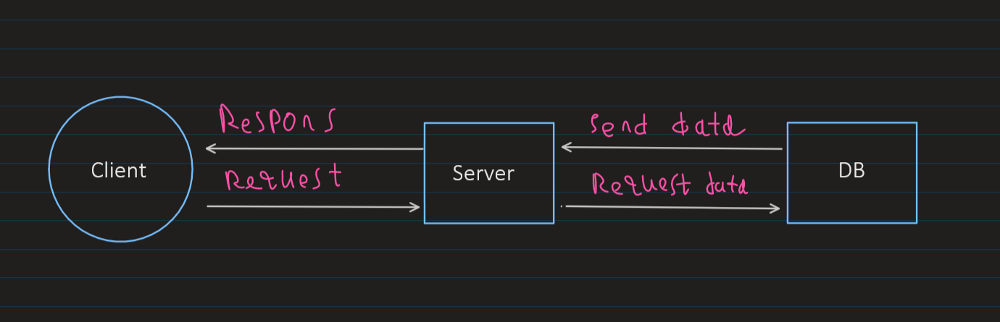

# bearer-auth

## Deployment URL
[bearer-auth](https://bearer-auth-41cl.onrender.com/)

Author: Mohammad Attallah

## Signup 
- **Route:** POST /signup
- **Description:** Creates a new user .
- **Request Body:** JSON object containing user record ( username,password).
```Json
{
    "username": "mohammad",
    "password":"pass1234"
}
```
## Signin
- **Route:** POST /signin
- **Description:** Authorized login  .
- **Request Body:** JSON object (Basic Auth) containing  ( username,password).
```Json
{
    "username": "mohammad",
    "password":"pass1234"
}
```
- **Respons:** data for user  

## get All users 

- **Route:**get /users (require Auth)
- **Request Body:** JSON object  all users signup( username).


## WRRC
